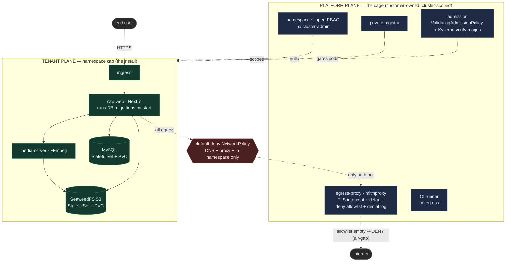
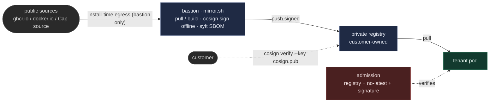

# Architecture

Two planes. The **platform plane** is the cage (the customer's environment, simulated). The
**tenant plane** is the install — one namespace, assumes nothing about the cluster.

Enforcement is CNI-agnostic: a plain default-deny `NetworkPolicy` forces all egress through
the proxy (the only allowed path), and the proxy does the L7 allowlist + TLS interception +
logging. With the allowlist empty, nothing egresses — the app still serves (air-gap).

## Supply chain

The repo ships the recipe and the public key, not the images. A bastion with temporary
egress mirrors every image into the customer's private registry, signs it offline, and
writes an SBOM; the customer verifies with the public key alone.

## Two targets

The same chart runs on both; only a values profile differs (kind uses `kind load`ed public
images; GKE pulls from the customer registry via `global.imageRegistry`). Image refs are
identical modulo the registry prefix — verified with `helm template`.
